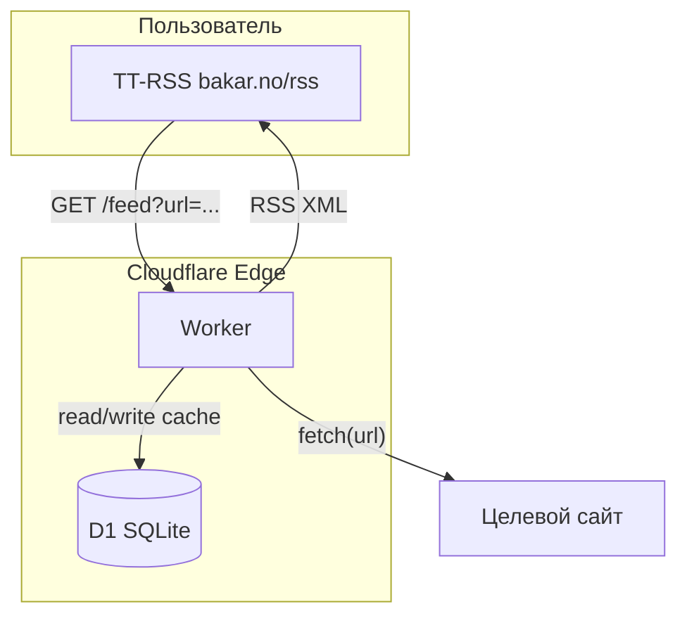

# План: Cloudflare Worker — генератор RSS из веб-страниц

## Цели и ограничения

- **Платформа:** Cloudflare Workers (бесплатный тариф)
- **Деплой:** только через браузер (Dashboard, без Wrangler/Node/bash)
- **Хостинг:** независим от bakar.no — Worker работает на edge Cloudflare
- **TT-RSS:** подписывается на URL вида `https://rss-gen.xxx.workers.dev/feed?url=example.com`

## Архитектура




## Компоненты

### 1. Роутинг Worker


| Endpoint            | Назначение                                                                 |
| ------------------- | -------------------------------------------------------------------------- |
| `GET /feed?url=...` | Возвращает RSS 2.0. Параметр `url` — целевая страница (с или без https://) |
| `GET /`             | Простая инструкция по использованию                                        |


### 2. Логика генерации фида

1. **Валидация URL** — проверка формата, блокировка file://, localhost и т.п.
2. **Кэш** — проверка D1: есть ли свежий (например, < 30 мин) результат для этого URL
3. **Fetch** — `fetch(targetUrl)` с User-Agent и таймаутом
4. **Парсинг** — извлечение ссылок через HTMLRewriter (встроенный API Workers)
5. **Фильтрация** — отсев навигации, якорей (#), рекламы, дубликатов
6. **Генерация RSS** — формирование XML (RSS 2.0) с полями: title, link, guid, pubDate
7. **Сохранение** — запись результата в D1 для последующего кэша

### 3. Хранилище (D1)

**Таблица `feeds`:**

```sql
CREATE TABLE feeds (
  url_key TEXT PRIMARY KEY,    -- хэш/нормализованный URL
  target_url TEXT NOT NULL,
  rss_xml TEXT NOT NULL,
  item_count INTEGER,
  updated_at TEXT NOT NULL     -- ISO timestamp
);
```

- **Почему D1, а не KV:** на бесплатном плане KV — 1000 записей/день. При 20–50 фидах и обновлении раз в 30 мин это легко превысить. У D1 — 100k записей/день.

### 4. Парсинг HTML

**HTMLRewriter** (встроенный, без зависимостей):

- Обработка тегов `a[href]`
- Сбор `href` и текста ссылки
- Поддержка CSS-селекторов (например, `main a`, `article a` для сужения области)

**Эвристики фильтрации:**

- Исключать ссылки с `#`, `javascript:`, `mailto:`
- Исключать типичные сегменты навигации: `/tag/`, `/category/`, `/author/`
- Лимит: первые 20–30 уникальных ссылок (остальное — шум)

### 5. Формат вывода

RSS 2.0 с минимальным набором полей, совместимый с TT-RSS:

```xml
<?xml version="1.0" encoding="UTF-8"?>
<rss version="2.0">
  <channel>
    <title>example.com — generated feed</title>
    <link>https://example.com</link>
    <item>
      <title>...</title>
      <link>...</link>
      <guid>...</guid>
    </item>
  </channel>
</rss>
```

---

## Деплой без bash

### Вариант A: Dashboard (ручная настройка)

1. **Cloudflare Dashboard** — [dash.cloudflare.com](https://dash.cloudflare.com)
2. **Workers & Pages** — Create Application — Create Worker
3. **D1** — Create database `rss-gen-db`
4. **Worker Settings** — Add binding: Variable name `DB`, D1 database `rss-gen-db`
5. **D1 Console** — выполнить SQL для создания таблицы (один раз)
6. **Quick Edit** — вставить код Worker, Deploy

### Вариант B: Deploy to Cloudflare (одна кнопка)

- Репозиторий в GitHub с полным проектом
- Кнопка `Deploy to Cloudflare` в README
- Cloudflare создаёт Worker, D1 и привязки автоматически
- Для создания таблицы — либо миграция при первом запросе (`CREATE TABLE IF NOT EXISTS`), либо отдельная инструкция по D1 Console

---

## Структура проекта (для репозитория)

```
rss-gen-worker/
├── src/
│   └── index.js          # Основной код Worker
├── schema.sql            # SQL для D1 (CREATE TABLE)
├── wrangler.toml         # Конфиг для Deploy to Cloudflare
└── README.md             # Инструкция + Deploy-кнопка
```

**Важно:** `wrangler.toml` нужен только при Deploy to Cloudflare. При ручном деплое через Dashboard код вставляется вручную, D1 создаётся и привязывается вручную.

---

## Лимиты бесплатного тарифа


| Ресурс           | Лимит       | Оценка для 20–50 фидов              |
| ---------------- | ----------- | ----------------------------------- |
| Workers requests | 100k/день   | Достаточно                          |
| D1 reads         | 5M/день     | Достаточно                          |
| D1 writes        | 100k/день   | Достаточно                          |
| Cron Triggers    | 1 на Worker | Опционально для фонового обновления |


---

## Опциональные улучшения (после MVP)

1. **Cron** — периодическое обновление кэша (например, раз в час)
2. **Настраиваемые селекторы** — `?selector=article a` для сложных сайтов
3. **Atom** — альтернативный формат вывода
4. **Readability** — извлечение полного текста через linkedom (больше CPU и памяти)

---

## Риски и ограничения

1. **Только статический HTML** — без headless-браузера; SPA и тяжёлый JS не поддерживаются
2. **Антибот** — часть сайтов может блокировать запросы с edge
3. **Разная вёрстка** — эвристики не идеальны; для сложных страниц возможны конфигурируемые селекторы

---

## Порядок реализации

1. Базовый Worker: fetch, HTMLRewriter, генерация RSS
2. Интеграция D1: кэш и схема
3. Фильтрация ссылок и эвристики
4. README и инструкции по деплою (Dashboard + Deploy-кнопка)
5. Тестирование на 2–3 реальных сайтах
